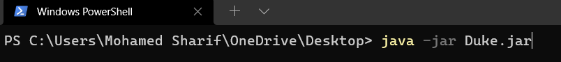

# Bao User Guide

Bao is a **desktop app for managing your tasks. It is optimized for use via a Command Line Interface** (CLI). If you can
type fast, Bao can manage your tasks faster than traditional GUI apps.

- [Set Up](#setting-up)
- [Features](#features)
  - [View help: `help`](#viewing-help-help)
  - [List all tasks: `list`](#list-all-tasks-list)
  - [Find Task by description keyword: `find`](#find-task-by-description-keyword-find)
  - [Add a ToDo: `todo`](#add-a-todo-todo)
  - [Add a Deadline: `deadline`](#add-a-deadline-deadline)
  - [Add an Event: `event`](#add-an-event-event)
  - [Delete a task: `delete`](#delete-a-task-delete)
  - [Mark task as done: `mark`](#mark-task-as-done-mark)
  - [Mark task as undone: `unmark`](#mark-task-as-undone-unmark)
  - [Exit Bao app: `bye`](#exit-bao-app-bye)

## Setting up

Prerequisites: Java 11.

1. Download the latest `bao.jar`.
2. Place the file into a folder you want to use as the home folder for your Bao.
3. Start the app. You should be able to see the following in CLI.
   1. From file explorer: Double-click the `jar` file.
   2. From CLI: Navigate to home folder and run `java -jar bao.jar`.
   
   
4. Type in commands in the command box and press Enter to execute it. (Type `help` for information within the app).
5. Refer to the [Features](#features) below for details of each command.

## Features

:memo: Notes about the command format:
- Words in `UPPER_CASE` are the parameters to be supplied by the user.
  e.g. in `find KEYWORD`, `KEYWORD` is a parameter which can be used as `find run`.

### View help: `help`
Shows a list of command formats available.

Format: `help`

### List all tasks: `list`
Shows a list of all tasks in the task list.

Format: `list`

### Find task by description keyword: `find`
Shows a list of all tasks in the task list that contains the keyword in their description.

Format: `find KEYWORD`
- Only the description of tasks will be searched for the keyword.
- It is considered a match if the keyword is part of a word in the description. E.g. `lock` will match `lockdown` and `clock`.

Example:
`find swim` will return tasks `swimming competition` and `go for swim`.

### Add a ToDo: `todo`
Adds a ToDo task to the task list.

Format: `todo DESCRIPTION`

Example:
`todo read a book`

### Add a Deadline: `deadline`
Adds a task with a deadline to the task list.

Format: `deadline DESCRIPTION /by DATETIME`
- `DATETIME` is to be provided in the format `dd/mm/yyyy HHmm`.

Example:
`deadline return car /by 20/04/2022 1600`

### Add an Event: `event`
Adds an event to the task list. Contains the date and time of the event.

Format: `event DESCRIPTION /at DATETIME`
- `DATETIME` is to be provided in the format `dd/mm/yyyy HHmm`.

Example:
`event Christmas gathering /at 20/04/2022 2000
`
### Delete a task: `delete`
Removes a task from the task list.

Format: `delete TASK_NUMBER`
- `TASK_NUMBER` can be obtained via `list`.

Example:
`list` followed by `delete 1` removes the 1st task in the task list.

### Mark task as done: `mark`
Marks a task in the task list as completed.

Format: `mark TASK_NUMBER`
- `TASK_NUMBER` can be obtained via `list`.

Example:
`list` followed by `mark 2` marks the 2nd task in the task list as completed.

### Mark task as undone: `unmark`
Marks a task in the task list as not completed.

Format: `unmark TASK_NUMBER`
- `TASK_NUMBER` can be obtained via `list`.

Example:
`list` followed by `unmark 3` marks the 3rd task in the task list as not completed.

### Exit Bao app: `bye`
Closes Bao app.

Format: `bye`