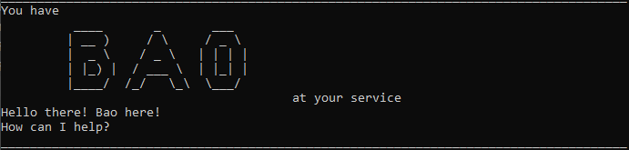

#Duke
##Introduction
Do you often forget your deadlines or lose track of the things you have to do for the week? Duke
comes to the rescue, Duke is a CLI (Command Line Interface) Application that helps you store various tasks you might have
so that you will never have to worry about forgetting ever again.

##Getting Started
In order for Duke to run properly on your computer, you should ideally have Java 11 installed on
your computer. If you are not sure on how to check if you have Java 11 installed on your computer,
you can refer to [Check Java](https://www.howtogeek.com/717330/how-to-check-your-java-version-on-windows-10/).

If you do not have Java already installed...
1. You can either download the Java Runtime Environment (JRE) from [Java](https://www.java.com/en/download/manual.jsp).
2. Or you can download the Java Development Kit (JDK) from [Oracle](https://www.oracle.com/java/technologies/downloads/).

Once you are sure that you have Java installed, you can download the latest version of Duke from
the releases.

###How do you run Duke?
You can run Duke straight from the Terminal or Command Prompt. Navigate to the directory in which
your jar file is located, and simply call `java -jar Duke.jar`. The naming of the jar file may differ
depending on the versions of Duke. You can also choose to save the command in a .bat or .sh file for
easier access in the future.

##Features
Duke has 12 in build commands that it can understand, you can use these 12 commands to direct Duke to
perform certain tasks and operations. These commands are listed below.

1. `help`
   - The help command explains all the different commands you can use and how to use them.
2. `list`
   - The list command generates a list of tasks that you have already created before.
3. `find`
   - The find command lets you search of tasks by their names (for e.g: `find homework`)  
4. `todo`
   - The todo command lets you add a todo task. A todo task requires a name to be entered as a parameter.
   (for e.g: `todo yoga`)
5. `deadline`
   - The deadline command lets you add a task that has a deadline. A deadline task requires a name, date and time.
   (for e.g: `deadline assignment 5 /by 2022-03-01 13:00`)
   The `/by` keyword is required before the date and time. Dates are in `YYYY-MM-DD` format. Time in `HH:MM` format.
6. `event`
   - The event command lets you add a task that happens at a particular date and time.
   An event task requires a name, date and time.
   (for e.g: `event graduation /by 2024-06-01 23:59`)
   The `/at` keyword is required before the date and time. Dates are in `YYYY-MM-DD` format. Time in `HH:MM` format.
7. `mark`
   - You can use the mark command to mark certain tasks in the list as done. Mark takes in a positive integer as a parameter.
   (for e.g: `mark 2`)
8. `unmark`
   - You can use the unmark command to unmark marked tasks in the list. Unmark takes in a positive integer as a parameter.
   (for e.g: `unmark 2`) 
9. `delete`
   - You can use the delete command to delete a task from the list. Delete takes in a positive integer as a parameter.
   All deleted tasks are sent to the `bin` which are them permanently destroyed on the exit of the app.
   (for e.g: `delete 4`)
10. `retrieve`
    - You can use the retrieve command to recover a task from the `bin`. Retrieve takes in a positive integer as a parameter.
    (for e.g: `retrieve 1`)
11. `bin`
    - You can view items you have deleted by saying `bin`.
12. `bye`
    - You can exit the application at any point in time by saying `bye`.

**_Hope you enjoy using Duke!_**
    
    
    

    

    

    

    
   