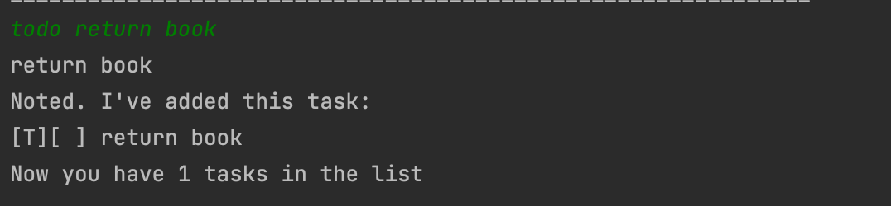
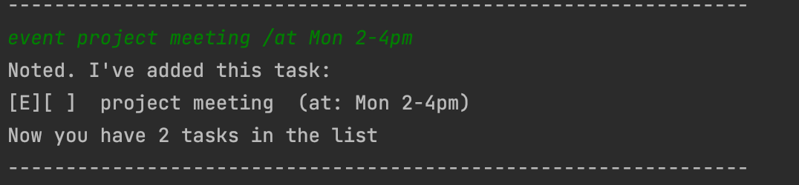
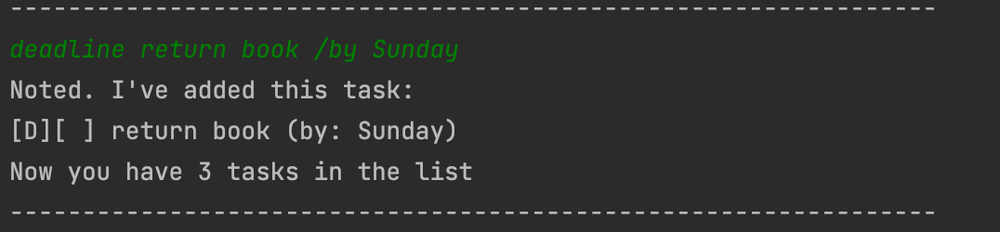
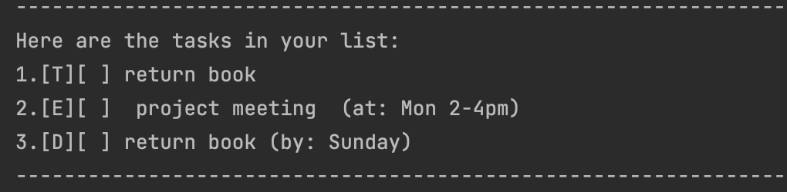
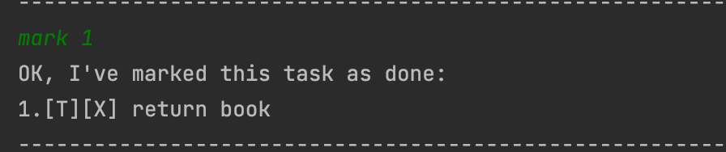
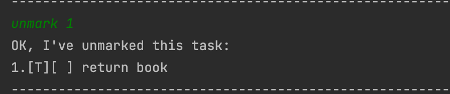
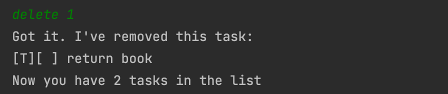
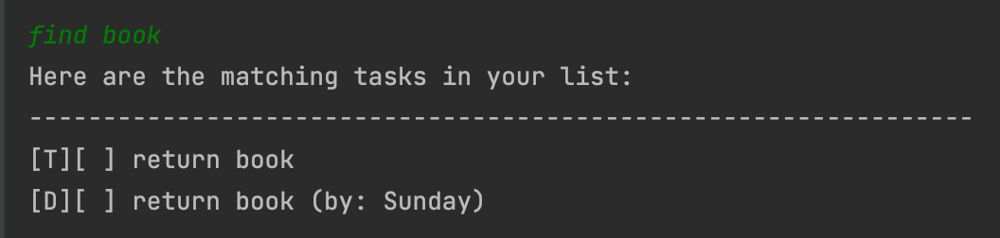

# User Guide for Duke
Duke is a software designed to help user keep track of their task using Command Line Interface.

## Before You Start
1. Make sure you have Java 11 installed on your computer
2. Download the latest JAR file from the [Repo](https://github.com/lelerer/ip).
3. Copy the file to the folder you want to use as your home folder for Duke application.
4. Run it in Terminal using command `java -jar ip.jar`

## Storage
The Duke application will automatically load the existing data from a 
file called `duke.txt`, if the file does not exist, the program will create one for you in your home directory.

## Features List
- Adding a new task
  - Add Todo: `todo`
  - Add Event: `event`
  - Add Deadline: `deadline`
- Listing all the current task: `list`
- Marking a Task as done: `mark`
- Marking a Task as not done: `unmark`
- Deleting a task: `delete`
- Finding a task: `find` 
- Closing the program: `bye`

## Features

### Feature-Adding a new task
There are three types of tasks that can be added in Duke, `Todo`, `Event`, and `Deadline`, each of them has its own format as shown below
#### Add Todo 

- Format: `todo DESCRIPTION`

- Example: todo return book

#### Add Event
- Format: `event DESCRIPTION /at EVENT_DATE`

- Example: event project meeting /at Mon 2-4pm

#### Add Deadline
- Format: `deadline DESCRIPTION /by DEADLINE_DATE`

- Example: deadline return book /by Sunday

### Feature - Listing all the current task
List all the tasks stored in Duke
- Format: `list`
- Example: list

### Feature - Marking a Task as done
Mark the selected task as done
- Format: `mark TASK_INDEX`
- Example: mark 1

### Feature - Marking a Task as not done
Mark the selected task as not done
- Format: `unmark TASK_INDEX`
- Example: unmark 1

### Feature - Deleting a task
Delete the selected task, note that the `TASK_INDEX` must not exceed the total number of tasks stored in Duke.

*The `TASK_INDEX` must be a positive integer*
- Format: `delete TASK_INDEX`
- Example: delete 1

### Feature - Finding a task 
Finds all task from the list of task that matches the given keyword.

*The KEYWORD refers to the search parameter. If the keyword is part of any task's description, it would return the task.
Note that the keyword is case sensitive*
- Format: `find KEYWORD`
- Example: find book

### Feature - Closing the program
Close the Duke program
- Format: `bye`

## Manually editing the date file
You could manually edit the `duke.txt` as well, the program will be able to capture the changes the next time it runs.
