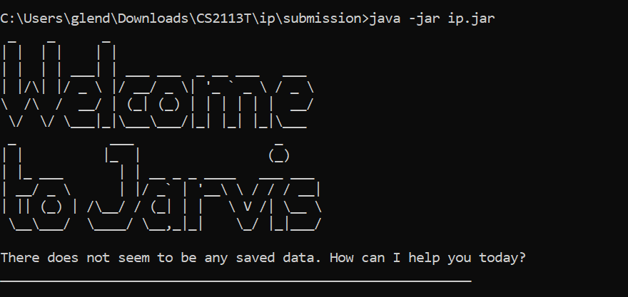
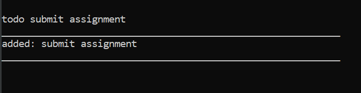
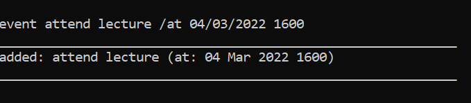
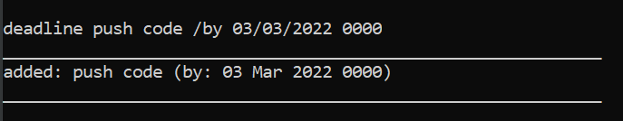
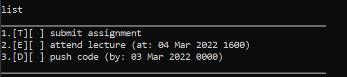
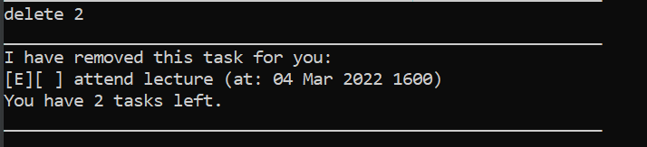
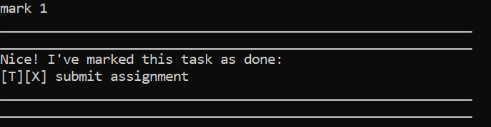
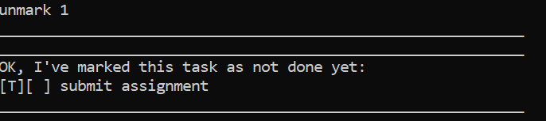
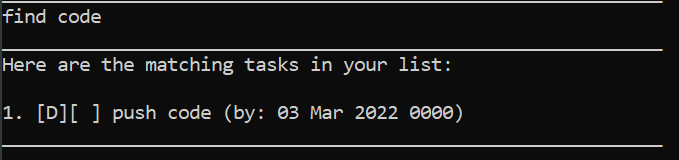
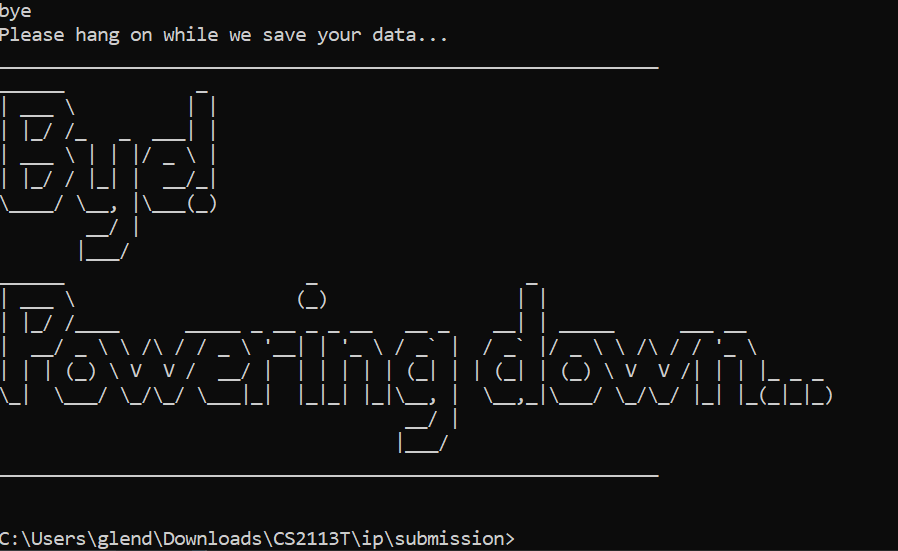

# User Guide
Jarvis is a Command-Line application for managing tasks, built for CS2113T Individual Project

## Quick Start
1. Ensure you have `Java11` or above installed in your computer.
2. Download the latest `Jarvis.jar` from [here](https://github.com/GlendonNotGlen/ip/releases/tag/A-UserGuide)
3. Move the downloaded file to a folder of your choice
4. Navigate a command-line application to the folder you have chosen
5. Type `java -jar Jarvis.jar` to run the program. If successful, you should see the following message:

6. Enter commands on the command-line for the program to start managing your tasks!
7. Refer to `Features` below for more information on each command

## Commands Summary  
| Command  | Format, examples                                                                            | 
|----------|---------------------------------------------------------------------------------------------|
| todo     | `todo <description`  e.g todo submit assignment                                         |
| event    | `event <description> /at DD/MM/YYYY HHMM` e.g event attend lecture /at 04/03/2022 1600  |
| deadline | `deadline <description> /by DD/MM/YYYY HHMM` e.g deadline push code /by 03/03/2022 0000 |
| list     | `list`                                                                                      | 
| delete   | `delete <task index>` e.g delete 2 to remove second task on your list               |
| mark     | `mark <task index>` e.g mark 1 to mark the first task on your list as done          |
| unmark   | `unmark <task index>` e.g unmark 4 to unmark the fourth task on your list           |
| find     | `find <keyword(s)>` e.g find lecture                                                    |
| bye      | `bye`                                                                                       |
 

## Features  
The following are features of the Jarvis bot. Please ensure that the number and format of arguments given is accurate 

### Add a Task to your list:`todo` 
Adds a task to your personal list. **One** task can only be added per command. 
Format:`todo <task>`  
Example:`todo submit assignment` 

### Add an Event to your list:`event`  
Adds an Event to your personal list. **One** event can only be added per command 
Note that the format of date and time has to follow as `DD/MM/YYYY` and `HHMM` exactly. 
The use of `/at` has to be included as well to separate your event's description from the date/time  
Format:`event <event description> /at DD/MM/YYYY HHMM` 
For example: `event attend lecture /at 04/03/2022 1600` 
 

### Add a Deadline to your list:`deadline`  
Adds a Deadline to your personal list. **One** deadline can only be added per command 
Note that the format of date and time has to follow as `DD/MM/YYYY` and `HHMM` exactly. 
The use of `/by` has to be included as well to separate your deadline's description from the date/time 
Format:`deadline <deadline description> /by DD/MM/YYYY HHMM` 
For example: `deadline push code /by 03/03/2022 0000` 
 

### Printing all current tasks/events/deadlines:`list` 
Shows a list of all current tasks, events and deadlines in your list. 
Format:`list` 
 

### Delete a task/event/deadline from your list:`delete` 
Delete a specified task/event/deadline from your list using its index. 
Use the `list` command to display the indices of your list. 
Format:`delete <index>` 
 

### Mark a task/event/deadline:`mark` 
Mark a task/event/deadline in your list as completed. You can only mark unmarked tasks, or a warning message will appear. 
Use the `list` command to display the indices of your list. 
Format:`mark <index>` 
 

### Unmark a task/event/deadline:`unmark` 
Unmark a task/event/deadline in your list. You can only unmark marked tasks, or a warning message will appear. 
Use the `list` command to display the indices of your list. 
Format:`unmark <index>` 
 

### Finding a task:`find` 
Finds a task/event/deadline description using the keyword(s) provided. 
Format:`find <keyword>` 
Example:`find code` 
 

### Saving your data 
Saving your current list is automated only at the end when you use the `bye` command. 

### Exiting the program:`bye` 
Saves your current list data inside a data folder and terminates the program. 
Format:`bye` 
 
