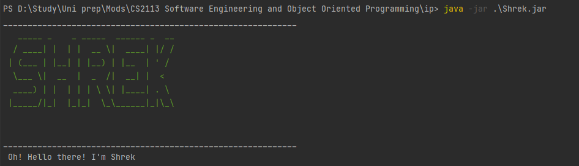

# Shrek - User Guide

* [Introduction](#introduction)
* [Quick start](#quick-start)
* [Features](#features)
    * [Viewing help: `help`](#viewing-help-help)
    * [Listing all tasks: `list`](#listing-all-tasks-list)
    * [Adding a Todo task: `todo`](#adding-a-todo-task-todo)
    * [Adding a Deadline task: `deadline`](#adding-a-deadline-task-deadline)
    * [Adding an Event task: `event`](#adding-an-event-task-event)
    * [Marking a task: `mark`](#marking-a-task-mark)
    * [Unmarking a task: `unmark`](#unmarking-a-task-unmark)
    * [Deleting a task: `delete`](#deleting-a-task-delete)
    * [Finding a task: `find task`](#finding-a-task-find-task)
    * [Finding a time: `find time`](#finding-a-task-find-task)
    * [Exiting the program: `bye`](#exiting-the-program-bye)
    * [Saving the data](#saving-the-data)
* [Command summary](#command-summary)

--------------------------------------------------------------------------------------------------------------------

## Introduction

Shrek is a **desktop app for managing tasks, optimized for use via a Command Line Interface** (CLI). If you would like
to manage your daily task, set deadlines and mark events, this is the app for you!

## Quick start

1. Ensure you have Java `11` or above installed in your Computer.

2. Download the latest `Shrek.jar` from [here](https://github.com/se-edu/addressbook-level3/releases).

3. Copy the file to the folder you want to use as the _home folder_ for your Shrek.

4. Open a command line terminal in your _home folder_ and run `java -jar Shrek.jar`. The startup interface similar to
   the below should appear in a few seconds.  
   

5. Type the command in the command box and press Enter to execute it. e.g. typing **`help`** and pressing Enter will
   show a help page.  
   Some example commands you can try:

    * **`list`** : Lists all tasks.

    * **`todo`**`Homework` : Adds a task named `Homework` to the list.

    * **`deadline`**`CS2113T Project Work`*`/by `*`2023-03-03 16:45` :
      Adds a task named `Homework` and deadline of `Mar 3 2023 4.45pm`to the list.

    * **`delete`**`2` : Deletes the 2nd task shown in the current list.

    * **`find`**`task`*`homework`* : Shows a list of all tasks containing `Homework`.

    * **`bye`** : Exits the app.

7. Refer to the [Features](#features) below for details of each command.

--------------------------------------------------------------------------------------------------------------------

## Features

**Command Format**

* Words in `UPPER_CASE` are the parameters to be supplied by the user e.g. in `todo TASK`,
  `TASK` is a parameter which can be used as `todo Homework`.

### Viewing help: `help`

Shows a summary of commands and how to use them  
Format: `help`
**Note:**

* Any additional input after `help` will be ignored

### Listing all tasks: `list`

Shows a list of all task currently in Shrek  
Format: `list`  
**Note:**

* Any additional input after `list` will be ignored

Sample Usage: `list`  

### Adding a Todo task: `todo`

Adds a Todo task to the task list  
Format: `todo TASK`  
Sample usage: `todo Homework`  

### Adding a Deadline task: `deadline`

Adds a task and its deadline to the task list  
Format: `deadline TASK /by DATE TIME`

* `DATE` is in the `yyyy:MM:dd` format
* `TIME` is in the `hh:mm`, 24hr format

**Note:**

* Midnight is represented 00:00 instead of 24:00
* Minimum supported year is `0001-01-01`

Sample usage: `deadline Wash Clothes /by 2022-04-01 23:59`  

### Adding an Event task: `event`

Adds a task and its occurrence date to the task list  
Format: `event TASK /at DATE TIME`

* `DATE` is in the `yyyy:MM:dd` format
* `TIME` is in the `hh:mm`, 24hr format

**Note:**

* Midnight is represented 00:00 instead of 24:00
* Minimum supported year is `0001-01-01`

Sample usage:`event ORD /at 2020-11-03 23:59`  

### Marking a task: `mark`

Marks a task as complete  
Format: `mark TASKINDEX`

Sample usage: `mark 1`  

### Unmarking a task: `unmark`

Unmarks a task that was previously marked  
Format: `unmark TASKINDEX`

Sample usage:`unmark 2`  

### Deleting a task: `delete`

Deletes a task from the task list  
Format: `delete TASKINDEX`

Sample usage: `delete 3`  

### Finding a task: `find task`

Finds all tasks containing a matching `KEYWORD` from the task list  
Format: `find task KEYWORD`

Sample usage:`find task work`  

### Finding a time: `find time`

Finds time in the tasks containing a matching `KEYWORD` from the task list  
Format: `find time KEYWORD`

Sample usage:`find time 59`  

### Exiting the program: `bye`

Exits the program  
Format: `bye`

**Note:**

* No additional input after `bye` is allowed

### Saving the data:

Shrek data are saved in the hard disk automatically after any command that changes the data. There is no need to save
manually.

## FAQ

Q: Why is my Shrek data not saved when I run Shrek in different folders?  
A: Shrek saves data in the current directory. To ensure all Shrek data is saved properly, 
run Shrek only in the _home folder_.  

## Command Summary

| Command   | Format, Examples                                                                     |
|-----------|--------------------------------------------------------------------------------------|
| Help      | `help`                                                                               |
| List      | `list`                                                                               |
| Todo      | `todo TASK`  e.g., `todo Homework`                                                |
| Deadline  | `deadline TASK /by DATE TIME`  e.g., `deadline Project Work /by 2022-05-05 23:59` |
| Event     | `event TASK /at DATE TIME`  e.g., `event Concert /at 2022-04-01 19:00`           |
| Mark      | `mark TASKINDEX`  e.g., `mark 1`                                                 |
| Unmark    | `unmark TASKINDEX`  e.g., `unmark 2`                                             |
| Delete    | `delete TASKINDEX`  e.g., `delete 3`                                             |
| Find Task | `find task KEYWORD`  e.g., `find at`                                             |
| Find Time | `find time KEYWORD`  e.g., `find 12`                                             |
| Bye       | `bye`                                                                                |
