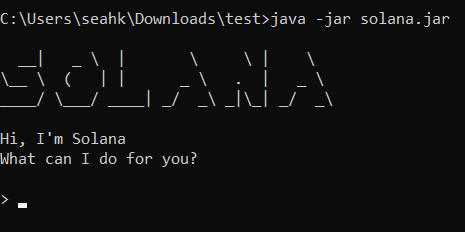
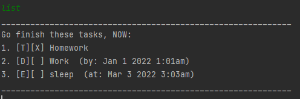

# Solana - User Guide
Solana is a ***desktop application for managing tasks, optimized for use via a Command Line Interface*** (CLI).

* [Quick start](#quick-start)
* [Features](#features)
  * [Viewing the help page](#viewing-the-help-page)
  * [Adding a Todo task](#adding-a-todo-task)
  * [Adding a Deadline task](#adding-a-deadline-task)
  * [Adding an Event task](#adding-an-event-task)
  * [Listing all tasks](l#isting-all-tasks)
  * [Deleting a task](#deleting-a-task)
  * [Marking a task as done](#marking-a-task-as-done)
  * [Marking a task as undone](#marking-a-task-as-undone)
  * [Finding a task](#finding-a-task)
  * [Saving the data]()
  * [Editing the data file]()
  * [Exiting the program](#exiting-the-program)
* [Command summary](#command-summary)

## Quick start
1. Ensure you have Java`11`or above installed in your computer.
2. Download the latest`solana.jar`from [here](https://github.com/khseah/ip/releases).
3. Copy the file to the folder you want to use as the _home folder_.
4. Open a command-line interface and navigate to the _home folder_. You should see the`solana.jar`file.
5. Type`java -jar solana.jar`to run the program. The startup interface similar to
   the below should appear in a few seconds.  
   
6. Type the command and press Enter to execute it. e.g typing **`help`** and pressing Enter will
   show the help page. 
   Some example commands you can try:
    * **`list`**: Lists all current tasks.
    * **`todo`**`borrow book`: Adds a Todo task named`borrow book`to the task list.
    * **`mark`**`1`: Marks the first task in the task list as done.
    * **`delete`**`2`: Deletes the second task in the task list.
    * **`bye`**: Exits the program.
7. Refer to the [Features](#features) below for details of each command.

## Features
Words in`[SQUARE_BRACKETS]`are the parameters.

### Viewing the help page: `help`
Lists the help page, which displays all the supported commands and their formats.
 Format: `help`

### Adding a Todo Task: `todo`
Adds a Todo task to the task list. Todo tasks are tasks without any date or time attached to it.
 Format: `todo [TASK]`

Examples:
 • todo borrow book
 • todo buy groceries

### Adding a Deadline task: `deadline`
Adds a Deadline task to the task list. Deadline tasks are tasks that need to be done by a specific date or time.
 Format: `deadline [TASK] /by [DUE_DATE]`

Examples:
 • deadline return book /by Sun 4pm
 • deadline submit assignment /by 4/3/2022

### Adding an Event task: `event`
Adds a Event task to the task list. Event tasks are tasks that start and end at a specific time.
 Format: `event [TASK] /at [START_TIME]`

Examples:
 • event project meeting /at Mon 2-4pm
 • event lecture /at Fri 4/3/2022 3-5pm

### Listing all tasks: `list`
Shows a list of all current tasks in the task list.
 Format: `list`

### Deleting a task: `delete`
Deletes a task from the task list.
 Format: `delete [INDEX]`

Deletes the task at the specified index. The index refers to the task number shown using the `list` command.  
 Examples:
 • delete 3
 • delete 1

### Marking a task as done: `mark`
Marks a task in the task list as done.
 Format: `mark [INDEX]`

Marks the task at the specified index. The index refers to the task number shown using the `list` command.  
 Examples:
 • mark 1
 • mark 3

### Marking a task as undone: `unmark`
Marks a task in the task list as undone.
 Format: `unmark [INDEX]`

Unmarks the task at the specified index. The index refers to the task number shown using the `list` command.    
 Examples:
 • unmark 1
 • unmark 3

### Finding a task: `find`
Finds a task in the task list based on the specified keyword(s).
 Format: `find [KEYWORD]`

Examples:
 • find book
 • find zoom meeting

### Saving the data
Task data is saved in the hard disk automatically after any command that modifies the task list. There is no need to save manually.

### Editing the data file
Tasks data is saved as a text file at`[home folder]/data/savedTasks.txt`. Users are welcome to update data directly by 
editing that data file. However, ensure that the format is consistent.
### Exiting the program: `bye`
Terminates the program.
 Format: `bye`

## Command Summary

| Action   | Format, Examples                                                              |
|----------|-------------------------------------------------------------------------------|
| Help     | `help`                                                                        |
| Todo     | `todo [TASK]`   e.g todo borrow book                                      |
| Deadline | `deadline [TASK] /by [DUE_DATE]`   e.g deadline return book /by Sun 4pm   |
| Event    | `event [TASK] /at [START_TIME]`   e.g event project meeting /at Mon 2-4pm |
| List     | `list`                                                                        | 
| Delete   | `delete [INDEX]`   e.g delete 3                                           |
| Mark     | `mark [INDEX]`   e.g mark 1                                               |
| Unmark   | `unnmark [INDEX]`   e.g unmark 1                                          |
| Find     | `find [KEYWORD]`   e.g find book                                          |
| Exit     | `bye`                                                                         |